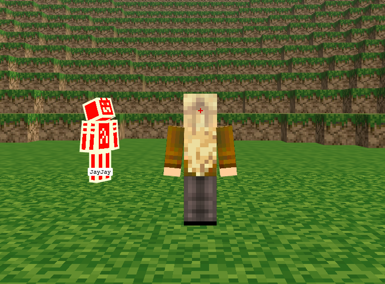

# voxel-label

Voxel-label is a [voxeljs module](http://voxeljs.com/#modules) that implements
[LabelPlugin](http://japhr.blogspot.com.es/2013/03/fun-with-threejs-camera-orientation.html), a three.js plugin that
adds labels to your game players (avatars). It can work in single-player mode as well as with
[voxel-client](https://github.com/maxogden/voxel-client) for labelling all avatars in a multiplayer game.

## Get it running on your machine

```
npm install
```

Run the start script:

```
npm start
```

This gets the server running on port 8080.

You may view a demo at http://127.0.0.1:8080. The demo adds another player to the Hello World demo. This player gets a label, JayJay.
The default Hello World player does not get a label. Click "R" to view both players.



# API

## require('voxel-label')(game)

Initializes the LabelPlugin

    LabelPlugin(game)
    
    
## require('voxel-label').label(labelText, avatar, game, client.playerID)
  
Create a label for a player:
    
    playerLabel = LabelPlugin.label(labelText, avatar, game, client.playerID)

Multi-player mode:

Make sure that your application populates a registration objects that has a username for the other players ("others").
[voxel-app-server](https://github.com/chrisekelley/voxel-app-server/blob/master/www/js/hello-world.js) has an example of how to do this.

The following code uses the emitter from voxel-client instance to check the update stream every second. It grabs the userInfo (player's username) from the update and adds it to the avatar. It only creates a label when the username does not match the playerId value in the labels array. 

    setTimeout(function() {
      client.emitter.on('update', function(updates) {
        Object.keys(updates.userInfo).map(function(playerId) {
          var update = updates.userInfo[playerId]
          if (playerId === self.playerID) return  // local playerId
          var playerSkin = this.others[playerId]
          if (playerSkin != null) {
            playerSkin.userInfo = update
            if (labels[playerId] !== playerSkin.userInfo.username) {
              var otherPlayerLabel = LabelPlugin.label(playerSkin.userInfo.username, playerSkin.mesh, game, playerId)
              labels[playerId] = playerSkin.userInfo.username
            }
          }
        })
      })
    }, 1000)

# Credits:

 - Much of the code for the LabelPlugin and Label.js comes from Chris Strom's blog:
http://japhr.blogspot.com.es/2013/03/fun-with-threejs-camera-orientation.html
 - Max Ogden for creating [voxeljs](http://voxeljs.com)

## license

BSD
